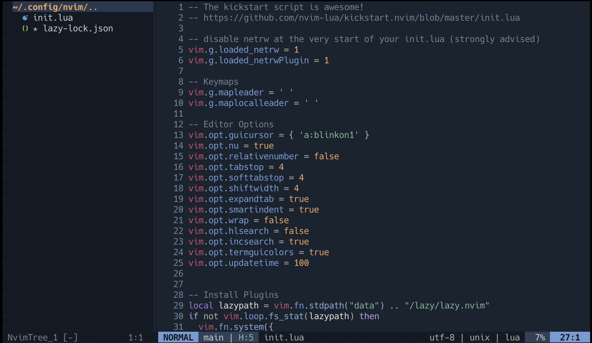

# Keybinds

## General

### Insert mode

* <leader>d - Opens floating diagnostic window -> usefull to see long error messages

### Visual mode

* C-space - Init selection + Node incremental selection
* S-space - Node decremental selection

## Telescope

* <leader><leader> - Opens the find files telescope window
    * <leader>sf - Alias. Mnemonic: [S]earch [F]iles
* <leader>ss - Opens the live grep window. Mnemonic: [S]earch [S]tring(s)
* <leader>sb - Fuzy search in the current buffer. Mnemonic: [S]earch in current [B]uffer
* <leader>rf - Opens the recent files window. Mnemonic [R]ecent [F]iles
    * <leader>e - Alias.
* <leader>gr - Opens the LSP references window. Mnemonic: [G]oto [R]eferences
* <leader>b - Opens the buffers list. Mnemonic: See [B]uffers

## Undo Tree

* <leader>u - Opens undo tree

## Fugitive (Git wrapper)

* <leader>vc - Opens the fugitive window. Mnemonic: [V]ersion [C]control

## LSP
